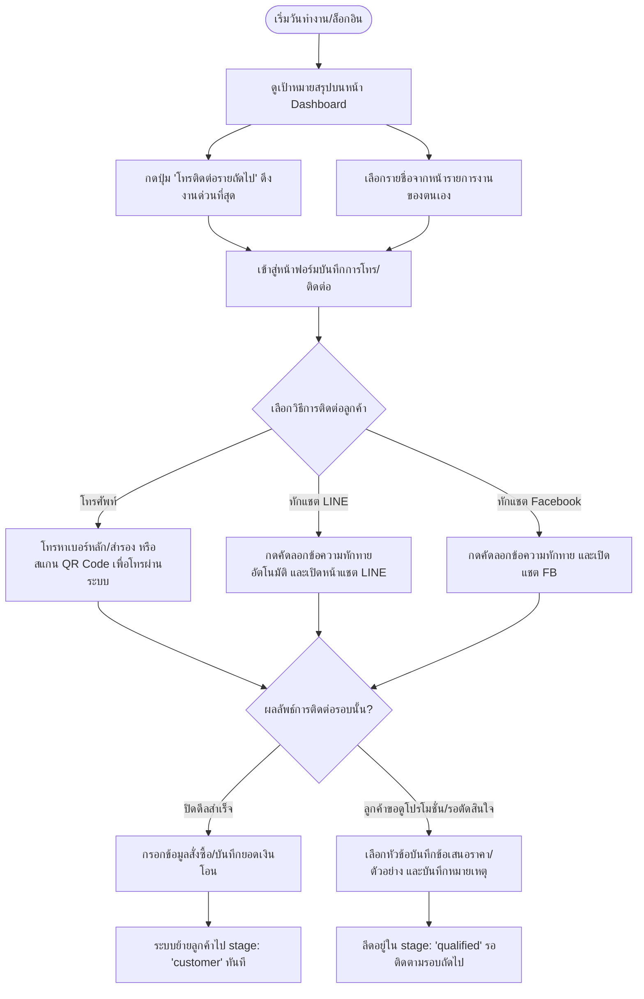
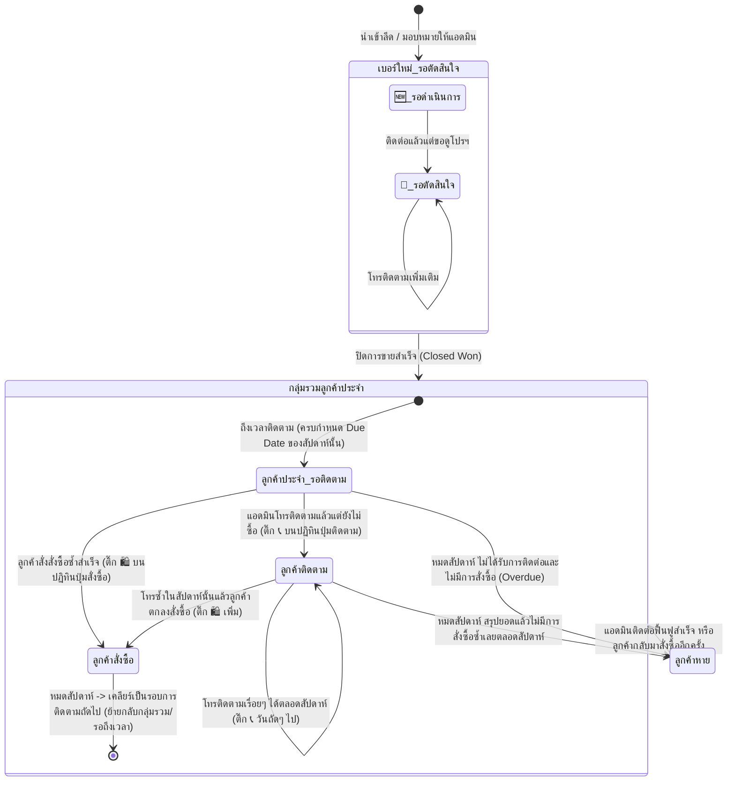

# รายงานวิเคราะห์กระบวนการทำงานและระบบการติดตามลูกค้าประจำ (Retention Workflow & System Design)

รายงานฉบับนี้อธิบายลำดับขั้นตอนการทำงานในระบบ CRM ตั้งแต่เริ่มต้นนำเข้ารายชื่อ การบริหารจัดการของผู้จัดการ (Manager) การดำเนินงานของแอดมิน (Admin) ตลอดจนถึงการเคลื่อนไหวของข้อมูลลูกค้า และ **การปรับปรุงระบบลูกค้าประจำ (Regular Customer) ตามเงื่อนไขใหม่**

---

## 1. ภาพรวมสเตจของลูกค้าในระบบปัจจุบัน (Customer Stages)

รายชื่อลูกค้าในระบบจะถูกจำแนกออกเป็น **สเตจหลัก (Stages)** ดังนี้:
1. **Pool (คลังหลัก / เบอร์ใหม่)**: รายชื่อที่เพิ่งนำเข้า ยังไม่ได้รับการคัดกรองจากแอดมิน หรือเป็นรายชื่อที่บอทคัดกรองเบื้องต้นแล้ว
2. **Qualified (ลูกค้ารอตัดสินใจ)**: ลูกค้าที่แอดมินติดต่อแล้วแต่ยังปิดการขายไม่ได้ มีความสนใจบางส่วน หรือขอข้อเสนอราคา/ตัวอย่างสินค้า
3. **Customer (ลูกค้าประจำ / ประวัติสั่งซื้อ)**: ลูกค้าที่แอดมิน **ปิดการขายสำเร็จ** ในรอบแรกและต้องการการดูแลระยะยาว
4. **Lost (ลูกค้าหาย)**: ลูกค้าประจำที่เลยกำหนดวันสั่งซื้อซ้ำรอบถัดไปแล้ว หรือติดต่อแล้วไม่ซื้อเลยตลอดรอบความถี่ (สัปดาห์)
5. **Trash (ถังขยะ)**: รายชื่อที่ถูกย้ายมาพักไว้เป็นเวลา 30 วันก่อนจะลบออกถาวร

---

## 2. ขั้นตอนการทำงานของผู้จัดการ (Manager Workflow)

ผู้จัดการทำหน้าที่เป็น **"ผู้คุมทิศทางและกระจายงาน"** โดยมีขั้นตอนดังนี้:

### ขั้นตอนที่ 1: การนำเข้าข้อมูลลูกค้า (Ingestion)
- ทำการซิงก์ข้อมูลจาก Google Sheets แบบไฮบริด (`syncFromSheetsHybrid`) หรืออัปโหลดไฟล์ `.csv` เข้าสู่หน้าคลังเบอร์โทร (`master-pool`)
- รายชื่อใหม่จะเข้ามาด้วย `stage: 'pool'` และ `status: '🆕 รอดำเนินการ'`

### ขั้นตอนที่ 2: การคัดกรองและประเมินด้วยบอท (Bot Assessment)
- บอทจะทำการโทร/คัดกรอง และประเมินความสนใจเบื้องต้น บันทึกคำตอบแบบสอบถาม 6 ข้อ (Q&A) ลงในระบบ พร้อมให้ระดับความสนใจ (`bot_score` 1-5 ดาว) เพื่อช่วยผู้จัดการประเมินความสำคัญของรายชื่อ

### ขั้นตอนที่ 3: การมอบหมายงาน (Job Assignment)
- ผู้จัดการเข้าหน้า **"มอบหมายงาน" (AssignLeadsView)** เลือกแท็บกลุ่มที่ต้องการมอบหมาย (เช่น เบอร์ใหม่, รอตัดสินใจ หรือลูกค้าประจำ)
- ผู้จัดการสามารถติ๊กเลือกรายชื่อทีละคน หรือระบุจำนวนเพื่อ **"เลือกด่วน" (Quick Select)**
- เลือกแอดมินผู้รับผิดชอบ และกดปุ่มยืนยันมอบหมายงาน ระบบจะเปลี่ยนฟิลด์ `responsibleId` และ `responsibleName` ทันที

### ขั้นตอนที่ 4: การโอนย้ายงานระหว่างแอดมิน (Transfer)
- หากมีแอดมินเข้า-ออก หรือต้องการเฉลี่ยภาระงาน ผู้จัดการสามารถใช้ฟีเจอร์ **"โอนย้าย" (Transfer)** เพื่อสลับรายชื่อลูกค้าจากแอดมินคนหนึ่งไปยังอีกคนหนึ่ง โดยเลือกโอนทั้งหมดหรือระบุจำนวนรายการได้

---

## 3. ขั้นตอนการทำงานของแอดมิน (Admin Workflow)

แอดมินทำหน้าที่เป็น **"ผู้ดูแล ปิดการขาย และติดตามลูกค้า"** มีลำดับการทำงานดังนี้:

---

## 4. โครงสร้างระบบลูกค้าประจำตามรอบความถี่ (Retention System)

เมื่อลูกค้าสั่งซื้อสำเร็จครั้งแรก ลูกค้าจะเข้ามาอยู่ในตาราง **ลูกค้าประจำ (Retention)** ซึ่งเป็นจุดที่เรากำลังพัฒนาการติดตามให้เข้มข้นยิ่งขึ้น:

### สรุปโฟลว์ความถี่ (Frequency)
- แอดมินสามารถกำหนดความถี่ในการสั่งซื้อรอบถัดไป (เช่น ทุก 1 สัปดาห์, 2 สัปดาห์ หรือ 1 เดือน)
- ระบบจะคำนวณ **วันครบกำหนดสั่งซื้อซ้ำถัดไป (Next Due Date)** จาก `lastOrderDate` (วันที่สั่งซื้อล่าสุด) + ความถี่
- **ระบบล็อกความถี่ (Freq Lock)**: จะถูกล็อกไว้จนกว่าแอดมินจะสามารถช่วยทำยอดขายสั่งซื้อซ้ำสะสมจากลูกค้ารายนี้ได้ **2 ครั้งขึ้นไป** จึงจะสามารถแก้ไขปรับเปลี่ยนรอบการติดตามใหม่ได้ เพื่อเป็นการวิเคราะห์ความสม่ำเสมอในการซื้อจริงของลูกค้าก่อน

---

## 5. การทำงานร่วมกันกับระบบใหม่ที่นำเสนอ (Proposed Workflow Integration)

นี่คือการวางโครงสร้างการเคลื่อนที่ของข้อมูลตามที่ลูกค้าแจ้งความต้องการล่าสุด:

### คำอธิบายลำดับการย้ายกลุ่มอย่างละเอียด (ลำดับขั้นตอนสัปดาห์ต่อสัปดาห์):

1. **เริ่มต้น (ครั้งแรก)**: 
   - ลีดจากเมนู `เบอร์ใหม่` หรือ `ลูกค้ารอตัดสินใจ` เมื่อแอดมินปิดการขายสำเร็จและลงบันทึกยอดเงิน ข้อมูลจะขยับเข้าสู่ **กลุ่มรวมในลูกค้าประจำ** โดยเริ่มคำนวณรอบความถี่ (เช่น ทุก 1 สัปดาห์)
2. **เมื่อถึงสัปดาห์ที่ต้องติดตาม (Due Date)**:
   - ลูกค้าจะถูกดึงเข้าสู่กลุ่มย่อย **"ลูกค้าประจำ (รอติดตาม)"** เพื่อเตือนให้แอดมินเริ่มลงมือโทรติดต่อในสัปดาห์ปัจจุบัน
3. **การโทรคุยในสัปดาห์**:
   - แอดมินเปิดปฏิทินรายวัน (ดีไซน์ Idea 2) เพื่อลงบันทึกตามวันจริง:
     - **กรณี สั่งซื้อสำเร็จ**: แอดมินติ๊ก **สั่งซื้อ (🛍️)** ลูกค้าจะถูกย้ายไปกลุ่มย่อย **"ลูกค้าสั่งซื้อ"** ทันที เพื่อแสดงสถานะปิดงานในรอบนี้แล้ว
     - **กรณี ติดตามแต่ยังไม่ซื้อ**: แอดมินติ๊ก **ติดตาม (📞)** ลูกค้าจะถูกส่งไปกลุ่มย่อย **"ลูกค้าติดตาม"** ชั่วคราว 
     - **การโทรติดต่อซ้ำ**: สำหรับกลุ่ม "ลูกค้าติดตาม" แอดมินสามารถโทรคุยซ้ำได้เรื่อยๆ ทั้งสัปดาห์และติ๊กบันทึกเพิ่มในวันที่โทรจริงได้ และหากลูกค้าตัดสินใจสั่งซื้อขึ้นมา ก็เพียงแค่ติ๊กช่อง **สั่งซื้อ (🛍️)** ลูกค้าจะเปลี่ยนกลุ่มไปอยู่ **"ลูกค้าสั่งซื้อ"** ทันที
4. **การสรุปยอดเมื่อหมดสัปดาห์ (ขึ้นสัปดาห์ใหม่)**:
   - ระบบจะสแกนสถานะบันทึกบนปฏิทินของสัปดาห์ที่ผ่านมา:
     - **ลูกค้าที่อยู่ในกลุ่มสั่งซื้อ**: จะได้รับการเคลียร์สถานะ เพื่อกลับไปรอแจ้งเตือนการติดตามรอบถัดไปตามความถี่ (เช่น อีก 2 สัปดาห์จึงจะวนกลับมาขึ้นกลุ่มรอติดตามใหม่)
     - **ลูกค้าที่อยู่ในกลุ่มติดตาม (โทรติดตามแต่ไม่มีการสั่งซื้อเลยสักวันเดียว)**: ระบบจะสรุปยอดโดยอัตโนมัติและจัดประเภทลูกค้าคนนี้เป็น **"ลูกค้าหาย"** เพื่อย้ายเข้าสู่หน้าลูกค้าหาย
     - **ลูกค้าที่ยังค้างอยู่ในกลุ่มรอติดตาม (ไม่ได้โทรและไม่ได้ซื้อ)**: จะถือเป็นงานค้างที่เลยกำหนดชำระ/สั่งซื้อ (Overdue) และเปลี่ยนสเตจเป็น **"ลูกค้าหาย"** เช่นเดียวกัน
